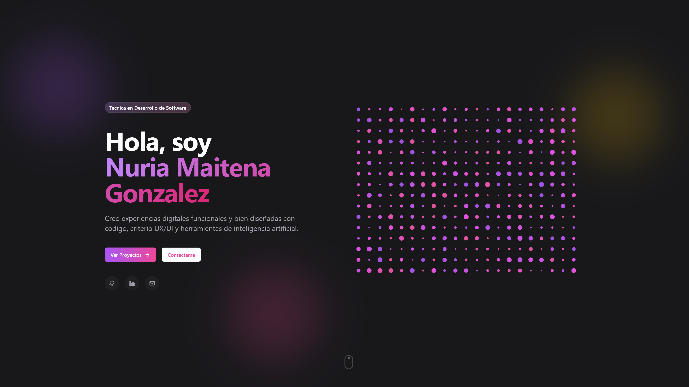

# Creative Portfolio
 
Un portfolio creativo moderno y responsive, desarrollado como proyecto propio.
## Demo en vivo

 
Mirá la demo en vivo: [https://portafolio-nuria.vercel.app/)
 
## Características
 
- Diseño responsive que funciona en todos los dispositivos
- UI moderna con animaciones suaves
- Sección de showcase de proyectos
- Sección "Sobre mí"
- Información de contacto
- Construido con tecnologías web de última generación
## Tecnologías utilizadas
 
- [Next.js](https://nextjs.org/) - El framework de React para producción
- [Tailwind CSS](https://tailwindcss.com/) - Framework CSS utility-first
## Primeros pasos
 
Para correr este proyecto localmente, seguí estos pasos:
 
1. Cloná el repositorio:
   \`\`\`bash
   git clone https://github.com/shinekyaw/Creative-Portfolio.git
   \`\`\`
2. Navegá al directorio del proyecto:
   \`\`\`bash
   cd Creative-Portfolio
   \`\`\`
3. Instalá las dependencias:
   \`\`\`bash
   npm install
   \`\`\`
4. Corré el servidor de desarrollo:
   \`\`\`bash
   npm run dev
   \`\`\`
5. Abrí [http://localhost:3000](http://localhost:3000) en tu navegador para ver el portfolio.
## Personalización
 
Para personalizar este portfolio para tu propio uso:
 
1. Actualizá el contenido en los componentes correspondientes
2. Reemplazá las imágenes de placeholder por las tuyas propias en la carpeta `public`
3. Modificá el esquema de colores en `tailwind.config.js`
4. Actualizá los metadatos en `app/layout.tsx`
## Despliegue
 
Este proyecto está preparado para un despliegue sencillo. Para desplegar tu propia versión:
 
1. Hacé un fork de este repositorio
2. Configurá tu plataforma de hosting preferida (por ejemplo, conectando tu cuenta de GitHub)
3. Seleccioná este repositorio y desplegá
Tu plataforma de hosting se encargará automáticamente del despliegue y te proporcionará una URL en vivo.
